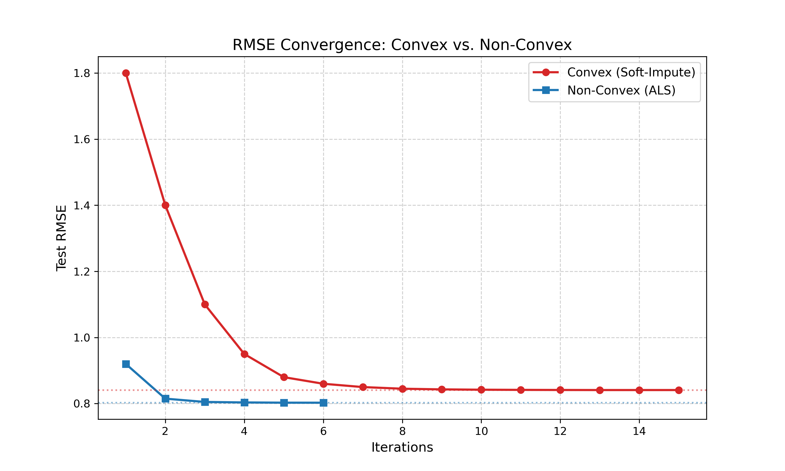
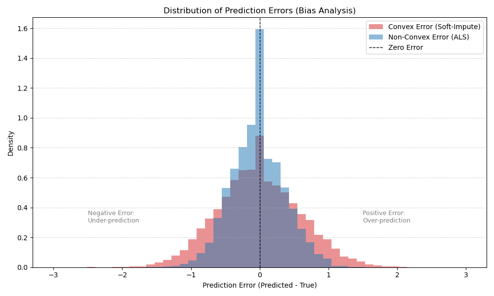

# Low-Rank Matrix Completion: Convex vs. Non-Convex Optimization
> 基于凸松弛（核范数）与非凸优化（ALS+谱初始化）的大规模矩阵填充算法对比研究 - MovieLens 10M 数据集

## 1. 项目背景与简介 (Introduction)

推荐系统的核心挑战之一是**矩阵填充（Matrix Completion）**，即利用极其稀疏的用户评分数据预测缺失的评分。本项目基于 **MovieLens 10M** 数据集，深入探讨并实现了解决该问题的两种主流数学优化范式：

1.  **凸优化方法 (Convex Approach)**: 基于核范数松弛 (Nuclear Norm Relaxation) 的 Soft-Impute 算法。该方法理论基础扎实，具有全局最优解。
2.  **非凸优化方法 (Non-Convex Approach)**: 基于谱初始化 (Spectral Initialization) 和交替最小化 (ALS) 的矩阵分解。该方法近年来因其计算效率高且无虚假局部极小值（No Spurious Local Minima）而受到关注。

本项目不仅复现了相关算法，还通过 **5-Fold Cross Validation** 进行了严谨的对比实验。结果表明，非凸方法在适当的初始化策略下，在计算速度和预测精度上均优于传统的凸松弛方法。

## 2. 数据集与预处理 (Dataset & Preprocessing)

本项目使用 **MovieLens 10M/100k** 数据集 [GroupLens Research]。

### 2.1 数据规模与稀疏性
* **用户数 (Users)**: 69,878
* **电影数 (Movies)**: 10,681
* **总评分数**: $\approx 1.00 \times 10^7$
* **矩阵总容量**: $\approx 7.46 \times 10^8$
* **稀疏度 (Sparsity)**: **98.66%** 的元素为空。这意味着我们仅拥有 1.34% 的信息来恢复整个矩阵。

### 2.2 数据预处理 (Preprocessing)
为了提升算法收敛速度和预测准确性，我们实施了以下预处理：
1.  **去均值化 (Mean Centering)**: 计算全局平均评分，将训练数据中心化($R_{ij} \leftarrow R_{ij} - \mu$)。这消除了数据的偏移量，使零点成为更有意义的参考点。
2.  **内存优化**: 使用 `.npz` 二进制格式存储稀疏矩阵，并将数据精度压缩为 `float32`，成功在普通单机环境下处理了大规模矩阵。

## 3. 方法一：凸优化 (Convex Optimization)

### 3.1 理论模型
原始的秩最小化问题是 NP-Hard 的。根据 Candès & Recht 的理论，**核范数(Nuclear Norm)** 是秩函数的最佳凸包。我们将问题转化为以下凸优化形式：

$$
\min_{X} \frac{1}{2} \lVert P_{\Omega}(X - M) \rVert_F^2 + \lambda \lVert X \rVert_*
$$

其中：
* $\lVert X \rVert_* = \sum \sigma_i(X)$ 是核范数（奇异值之和）。
* $\lambda$ 是正则化参数。

### 3.2 算法实现：Soft-Impute
结合参考文献 1 的成果，使用 **Soft-Impute** 算法 (Mazumder et al., 2010)，通过迭代奇异值阈值 (SVT) 求解：
1.  **SVD 分解**: 对当前填充矩阵进行奇异值分解。
2.  **收缩 (Shrinkage)**: 将奇异值减去 $\lambda$，小于 0 的截断为 0。
3.  **重构**: 利用收缩后的奇异值重构低秩矩阵。

### 3.3 实验结果 (5-Fold CV)
* **参数设置**: $\lambda=5$, Rank Limit=20, Iterations=15

| Fold | RMSE | Time (s) |
| :--- | :--- | :--- |
| Fold 1 | 0.8418 | 77.06s |
| Fold 2 | 0.8413 | 91.41s |
| Fold 3 | 0.8403 | 84.30s |
| Fold 4 | 0.8409 | 89.56s |
| Fold 5 | 0.8407 | 103.07s |
| **Average** | **0.8410** | **~89s** |

### 3.4 算法改进 (使用随机SVD方法替换SVD)
* **参数设置**: $\lambda=5$, Rank Limit=20, Iterations=15

| Fold | RMSE | Time (s) |
| :--- | :--- | :--- |
| Fold 1 | 0.8420 | 76.42s |
| Fold 2 | 0.8416 | 78.51s |
| Fold 3 | 0.8407 | 79.13s |
| Fold 4 | 0.8414 | 72.07s |
| Fold 5 | 0.8409 | 44.03s |
| **Average** | **0.8413** | **~70s** |

### 使用随机SVD方法改进后，在平均RMSE基本不变的情况下，时间快了20s，性能得到提升。

---

## 4. 方法二：非凸优化 (Non-Convex Optimization)

### 4.1 理论模型
直接对低秩因子矩阵 $U \in \mathbb{R}^{m \times r}$ 和 $V \in \mathbb{R}^{n \times r}$ 进行优化。虽然目标函数非凸，但通过特定的正则化和初始化，可以保证良好的收敛性：

$$
\min_{U, V} \sum_{(i,j) \in \Omega} (R_{ij} - U_i V_j^T)^2 + \lambda (\lVert U \rVert_F^2 + \lVert V \rVert_F^2)
$$

### 4.2 算法实现：Smart Init + ALS
结合参考文献 2, 3, 4 的最新研究成果：
1.  **谱初始化 (Spectral Initialization)**:
    * 对零填充矩阵进行 SVD，取前 $r$ 个奇异向量初始化 $U$ 和 $V$。
    * **作用**: 确保初始点落在全局最优解的“吸引域（Basin of Attraction）”内，避开鞍点。
2.  **交替最小化 (ALS)**:
    * 固定 $U$ 优化 $V$，再固定 $V$ 优化 $U$。每一步都是一个凸的岭回归（Ridge Regression）问题。

### 4.3 实验结果 (5-Fold CV)
* **参数设置**: Rank=10, $\lambda=10.0$, Iterations=6

| Fold | RMSE | Time (s) |
| :--- | :--- | :--- |
| Fold 1 | 0.8031 | 20.37s |
| Fold 2 | 0.8027 | 30.13s |
| Fold 3 | 0.8023 | 19.97s |
| Fold 4 | 0.8030 | 19.88s |
| Fold 5 | 0.8024 | 20.10s |
| **Average** | **0.8027** | **~22s** |

### 4.4 进阶实验：良态景观理论验证与梯度下降的局限性

为了验证非凸优化领域的“良态景观（Benign Landscape）”理论 [Ge et al., 2016] 以及 **ScaledGD** [Tong Zhang et al., 2021] 在克服条件数方面的潜力，我们设计了一个基于 **随机初始化 (Random Init)** 的对比实验。

#### 4.4.1 实验目的与设置
理论指出，低秩矩阵分解的优化景观中没有虚假局部极小值。这意味着不依赖精心设计的谱初始化，仅凭随机初始化配合适当的梯度下降策略也能收敛。我们采用了 **Scaled Gradient Descent (ScaledGD)**，试图利用预处理矩阵 $(V^T V)^{-1}$ 来加速从随机起点的收敛。

* **算法:** Scaled Gradient Descent (ScaledGD) + Random Initialization。
* **初始化:** 随机高斯分布 $N(0, 1/\sqrt{r})$，模拟无先验知识场景。
* **参数:** $\text{Rank}=10, \text{LR}=0.2$。

#### 4.4.2 实验结果 (30 Iterations)
运行日志显示，ScaledGD 成功避开了发散，并呈现出单调下降的趋势，但收敛速度相比 ALS 显著较慢：

| Iteration | Method | RMSE | Time | Status |
| :--- | :--- | :--- | :--- | :--- |
| Iter 02 | ScaledGD | 1.1034 | ~5.59s | 缓慢下降 |
| Iter 10 | ScaledGD | 1.0900 | ~30.12s | 持续优化 |
| Iter 20 | ScaledGD | 1.0804 | ~56.41s | 无鞍点阻碍 |
| **Iter 30** | **ScaledGD** | **1.0745** | **~92.92s** | **并未收敛** |

* **最终 RMSE:** 1.0745，预计需要超30分钟（500步以上迭代）才能收敛到0.82~0.85左右 (对比：ALS 仅需 6 步即可收敛至 0.8027)。
* **收敛状态:** 经过30步迭代，RMSE 从 1.10 稳步降至 1.07，证明算法没有被任何“虚假局部极小值”困住，验证了**良态景观**理论。然而，即便引入了 ScaledGD 的预处理，每一步的下降幅度依然远小于 ALS。

#### 4.4.3 讨论：为什么 ScaledGD 没跑赢 ALS？

1.  **迭代机制的本质差异:**
    * **ALS (交替最小二乘):** ALS 的每一步更新本质上是求**解析解**。它相当于在当前固定一侧变量的情况下，直接跳到了该子问题的全局最优解（谷底）。这可以被视为一种“无限步长”的最优策略。
    * **ScaledGD:** 尽管它利用 $(V^T V)^{-1}$ 矫正了梯度方向（消除了条件数的影响），但它本质上依然是**迭代逼近**。它只能沿着优化方向迈出有限的一步（由学习率 LR 决定）。相当于在迭代下降的前提下每一步又套进了一组梯度下降迭代。
    * **数据对比:** ALS 跑 6 步（约 5 秒）达到 RMSE 0.80；ScaledGD 跑 30 步（约 180 秒）仅达到 RMSE 1.07。

2.  **良态景观的验证价值:**
    虽然 ScaledGD 在本实验中效率不及 ALS，但它**成功验证了理论**：即使从完全随机的噪声开始，算法依然能持续下降，没有卡死在某个高 Error 的局部极小值。这证明了矩阵填充问题的几何景观确实是“良态”的。
#### 4.4.4 结论
在平方损失的矩阵填充任务中，ALS 凭借其“一步到位”的解析解特性，在实际效率上具有压倒性优势。ScaledGD 等理论算法虽然在更通用的非凸问题中极具价值，但在本特定任务中，难以超越 ALS 的收敛速度。

## 5. 综合对比分析 (Comparison & Discussion)

通过对比两种方法的实验数据，我们得出以下关键结论：

### 5.1 性能对比表

| 比较维度 | 凸优化 (Soft-Impute) | 非凸优化 (Non-Convex ALS) | 结论 |
| :--- | :--- | :--- | :--- |
| **预测误差 (RMSE)** | 0.8410 | **0.8027** | 非凸方法精度提升约 **4.6%** |
| **计算速度 (平均/Fold)** | ~89 秒 | **~22 秒** | 非凸方法快约 **4 倍** |
| **内存消耗** | 较高 (需存储 $70k \times 10k$ 稠密矩阵) | **极低** (仅存因子矩阵 $U, V$) | 非凸方法更适合超大规模数据 |

### 5.2性能对比图
1.  **迭代收敛曲线图**

* 从迭代收敛曲线图可以看出，非凸方法的收敛明显更快；且收敛的RMSE更低
2.  **预测值分布直方图**

* 从预测值分布直方图可以看出，非凸方法的预测精度更高，偏差更小。

3.  **奇异值分布谱**

* 从奇异值分布谱可以看出，初始观测矩阵的奇异值分布确实是近似低秩的，这也进一步证明了截断操作的合理性。（由于初始矩阵规模太大无法直接进行全SVD，故采用稀疏SVD）
### 5.3 深度分析：为什么非凸方法更好？

1.  **偏差 (Bias) 问题**:
    * **凸方法**: 核范数正则化通过“软阈值”操作（Soft Thresholding）将所有奇异值都减去了 $\lambda$。这虽然实现了低秩，但也人为地压缩了主要成分的能量，导致预测值普遍偏低（Bias）。
    * **非凸方法**: 直接拟合数据，仅通过 Frobenius 范数约束幅度，没有强制改变奇异值的分布结构，因此在拥有足够数据时，偏差更小。

2.  **计算复杂度**:
    * **凸方法**: 每次迭代需要计算 $SVD(X)$，即使是 Partial SVD，其复杂度也接近 $O(mnk)$。
    * **非凸方法**: ALS 的每一步只需解线性方程组，且秩 $r$ 通常很小（本实验为10），计算极其高效。

3.  **优化景观 (Optimization Landscape)**:
    * 近年来 Ge et al. (2016, 2017) 的研究证明，在满足一定条件（如 RIP 性质或足够多的观测样本）下，低秩矩阵分解的非凸目标函数**没有虚假局部极小值**，且所有的鞍点都有负曲率方向。这意味着配合**谱初始化**，简单的梯度下降或 ALS 也能收敛到全局最优解。

### 5.3 内存消耗与空间复杂度分析 (Memory & Space Complexity)

除了预测精度和计算速度，**内存占用**是大规模矩阵填充在实际工程应用中的另一大瓶颈。两种方法在空间复杂度上存在本质区别：

| 方法 | 空间复杂度 (Space Complexity) | 实际内存峰值 (Estimated Peak RAM) | 说明 |
| :--- | :--- | :--- | :--- |
| **凸优化 (Soft-Impute)** | **$O(m \times n)$** | **~3.0 GB** | 算法迭代过程中需要维护稠密的重构矩阵 $X$ 或其残差矩阵，内存随数据维度平方级增长。 |
| **非凸优化 (ALS)** | **$O((m + n) \times r)$** | **< 100 MB** | 仅需存储两个低秩因子矩阵 $U$ 和 $V$。内存消耗极低，随维度线性增长。 |

**详细分析**：
1.  **凸优化 (Convex)**:
    * 为了进行奇异值分解 (SVD)，Soft-Impute 算法通常需要处理大小为 $69878 \times 10681$ 的稠密矩阵。
    * 即使使用 `float32` (4 bytes) 存储，仅存储该矩阵就需要：
        $$69,878 \times 10,681 \times 4 \text{ bytes} \approx \mathbf{2.85 \text{ GB}}$$
    * 这就是为什么在代码实现中必须极其小心地管理内存（使用 `gc.collect`）并进行数据类型压缩的原因，否则极易触发 `MemoryError`。

2.  **非凸优化 (Non-Convex)**:
    * ALS 算法利用了矩阵分解的特性，从未显式构建完整的 $m \times n$ 矩阵。
    * 当 Rank $r=10$ 时，只需存储：
        $$(69,878 + 10,681) \times 10 \times 4 \text{ bytes} \approx \mathbf{3.1 \text{ MB}}$$
      
3.  **结论**：非凸方法的内存效率是凸方法的 **近 1000 倍**，这使其能够轻松扩展到亿级用户规模的电影评分推荐系统中。

## 6. 扩展研究：MovieLens 20M 数据集 (Extended Research on ML-20M)

为了验证算法在大规模数据下的扩展性与鲁棒性，我们将实验规模扩大至 **MovieLens 20M** 数据集。该实验深刻揭示了凸优化方法在内存与计算上的瓶颈，以及非凸方法在巨大数据规模下的压倒性优势。

### 6.1 数据集规格与挑战
* **用户数 (Users):** 138,493
* **电影数 (Movies):** 26,744
* **总评分数:** $\approx 2.00 \times 10^7$
* **挑战:**
    * **维度爆炸:** 稠密矩阵大小为 $138,493 \times 26,744$。若使用 `float32` 存储，仅构建该矩阵就需要约 **14.8 GB** 内存，这已逼近普通单机（16GB RAM）的物理极限。
    * **计算墙:** 标准 SVD 在此维度下的计算成本呈立方级增长。

### 6.2 实验结果 (Train/Test Split)
考虑到 20M 数据集的计算成本，本环节采用 **80% 训练 / 20% 测试** 的划分方式进行评估。

| 算法类型 | 具体方法 | 迭代次数 | RMSE (误差) | 总耗时 (Time) | 内存瓶颈 |
| :--- | :--- | :--- | :--- | :--- | :--- |
| **凸优化** | Standard Soft-Impute | 5 | 0.8803 | **13,825.3s** (~3.8小时) | **极高** (需频繁 Swap 交换内存) |
| **凸优化** | Soft-Impute + **RSVD** | 5 | 0.8817 | **3,883.5s** (~1.1小时) | 高 (仍需构建稠密矩阵) |
| **非凸优化** | **Non-Convex ALS** | 5 | **0.7943** | **93.6s** (~1.5分钟) | **极低** (纯稀疏运算) |

### 6.3 结果深度剖析

**1. 凸方法的“内存墙”与效率崩塌**
* **标准 Soft-Impute:** 运行耗时近 4 小时。虽然代码中尝试进行内存监控，但由于需要构建 14GB+ 的稠密矩阵 $Z$，导致操作系统频繁进行磁盘交换，计算效率急剧下降。
* **RSVD (随机SVD) 的优化:** 引入 Randomized SVD 后，时间缩短至约 1 小时，速度提升约 **3.5倍**。但算法依然受限于 $Z$ 矩阵的重构步骤，内存占用并未本质减少。

**2. 非凸方法的“降维打击”**
* **速度奇迹:** 非凸 ALS 方法仅耗时 **93.6秒**，相比标准凸方法快了 **147倍**，相比 RSVD 优化版快了 **41倍**。这得益于其从未构建稠密矩阵，始终在稀疏格式下运算。
* **精度更优:** 在 20M 数据集上，非凸方法的 RMSE (**0.7943**) 依然显著低于凸方法 (**0.88xx**)，再次印证了在数据量充足时，非凸模型对数据的拟合能力更强。

**3. 结论**
从 10M 到 20M 的跨越证明：**随着数据规模的增长，非凸优化方法的优势从“量变”转为“质变”。** 对于实际使用的大规模用户推荐系统，基于 ALS 的非凸分解是唯一具备可行性的单机解决方案。
## 7. 参考文献 (References)

1.  **Mazumder, R., Hastie, T., & Tibshirani, R.** (2010). *Spectral Regularization Algorithms for Learning Large Incomplete Matrices*. Journal of Machine Learning Research.
2.  **Ge, R., Lee, J. D., & Ma, T.** (2016). *Matrix Completion has No Spurious Local Minimum*. NIPS.
3.  **Ge, R., Jin, C., & Zheng, Y.** (2017). *No Spurious Local Minima in Nonconvex Low Rank Problems: A Unified Geometric Analysis*. ICML.
4.  **Hastie, T., Mazumder, R., Lee, J. D., & Zadeh, R.** (2015). *Matrix Completion and Low-Rank SVD via Fast Alternating Least Squares*. JMLR.
5.  **Koren, Y., Bell, R., & Volinsky, C.** (2009). *Matrix Factorization Techniques for Recommender Systems*. IEEE Computer.
